# Odin Project #23: JavaScript Final Project

Welcome to Bryan Miller's JavaScript Final Project, the [twenty third assignment](https://www.theodinproject.com/lessons/node-path-javascript-javascript-final-project) within the Odin Project curriculum. The goal of this repo is to practice the following skill sets:

- [**Whiteboarding**](src/README.md): project planning
- **Vite**: React, TypeScript + SWC
- **Firebase** (BaaS)
- npm packages:
  - `firebase`
  - `react-redux` (`@types/react-redux`)
  - `@reduxjs/toolkit` (`@types/react-redux`)
  - `react-router-dom`
  - `react-icons` (`@types/react-icons`)
  - `date-fns`
  - `sass`
  - `node-mailer`

## Links

- [Live Demo](https://comedy.bmilcs.com)
- [My Odin Project Progress](https://github.com/bmilcs/odin-project)

> desktop: home (more screenshots available below)

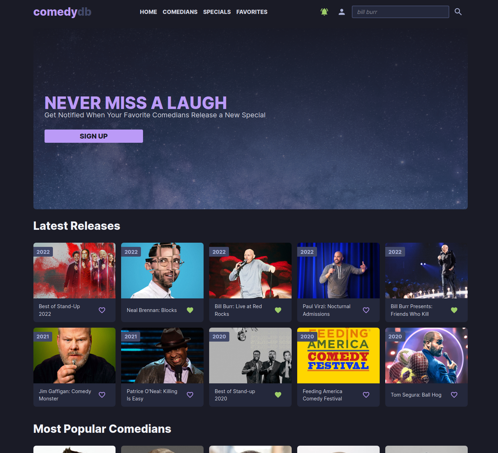

## Summary

For my final JavaScript project, I opted to solve a problem that interests me. Standup comedy is a passion of mine and I wanted a way to stay on track of my favorite comedians' work. With the countless streaming platforms out there, it's challenging to stay up to date and not miss out when a comedian releases new a special.

Standup comedy is a fairly small community, but I wanted users to be able to effortlessly add their favorite comedians to the site if missing from the database. In addition, e-mail notifications were a must. Nobody wants to check a website everyday for content that's released as infrequently as standup specials are. The most prolific comedians release a special once a year, but usually there are several years in between.

## High Level Breakdown

All content from the site is sourced from [TMDB (the movie database)](https://www.themoviedb.org/?language=en-US). My initial plan of fetching TMDB API data directly on the frontend didn't work out (explained below).

On the frontend, users can search for comedians in the header of the page. If they don't exist, they're presented with TMDB person search results. After clicking on their image in the search results, a second API query fetches that person's "movie" releases and the results are filtered by the standup comedy keyword. If the standup keyword exists, the user is able to add them to the site:

Using Firebase as my backend, a cloud function is invoked and it processes the fresh comedian personal data & special data from TMDB. It creates the following data structure:

```sh
#
# FIREBASE FIRESTORE DB STRUCTURE
#

/comedianPages/{comedianId}/ # for comedian pages: personal data & all specials

/comedianSubscribers/{comedianId} # for notifications: contains list of user id's/email addresses subscribed to a comedian

/comedians/all/ # used for search, all comedians page & favorite count tracking
/comedians/latest/ # used to track latest 10 comedians added to the site (by timestamp)
/comedians/topFavorites/ # used to track top 10 of all user favorites


/specialPages/{specialId} # for special pages: summary, comedian's info & other specials by comedian

/specials/all/  # all specials page & favorite count tracking
/specials/latest/ # latest 10 specials (by release date)
/specials/topFavorites/ # top 10 user favorite specials
/specials/upcoming/ # specials with a release_date > today


```

> Firebase uses NoSQL for their databases, which prefers de-normalized data. In other words, this concept calls calls for **data duplication** in order to limit the number of read calls and to optimize for read speed.

I tried to lean out each database entry to fit the requirements needed for the frontend. For example, the latest comedians data was reduced to:

- `id`: used for a data-attribute on the frontend: links to the `/comedians/109708` page
- `name`: display on the front end
- `profile_path`: displays on the frontend
- `dateAdded`: for sorting by the frontend

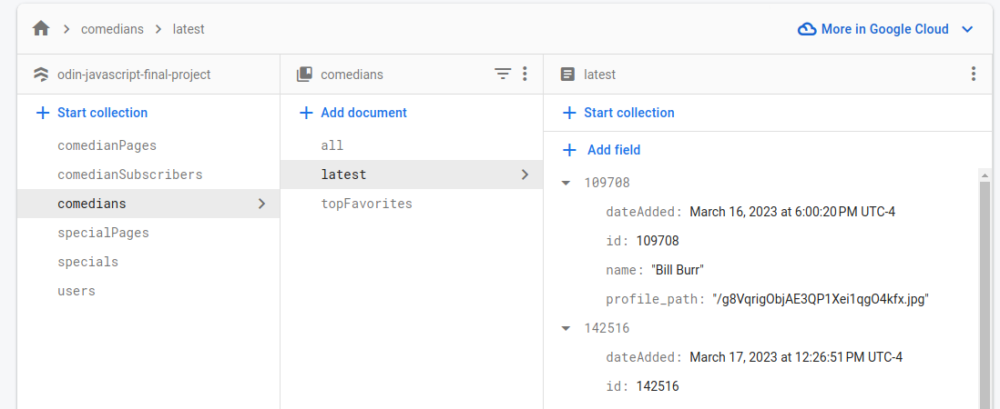

If de-normalization wasn't utilized, retrieving a comedian's page would have required multiple TMDB API calls and extra data processing on the frontend. Instead, a single call to firestore yields a consistent, type-safe & leaned out set of data:

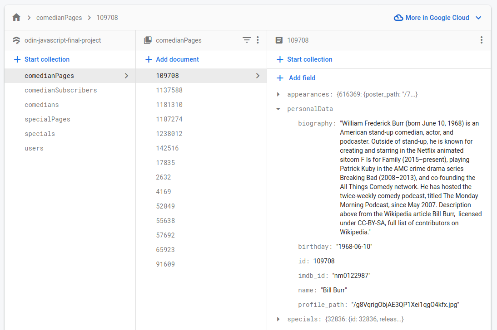

## PubSub Scheduled Updates

To retrieve new specials for comedians in the database, a function `getNewSpecialsForAllComedians()` is ran in the backend on a 12 hour interval.

Specials are released very infrequently, so when one is found, the same utility functions responsible for creating the database structure on adding a new comedian are called. This way, older special pages by the same comedian are also re-created to contain a link to the comedian's new special.

Due to de-normalization, the favorite count for the existing specials aren't lost. Favorite counts are stored in a separate db collection (`/specials/all`) and they're not affected on an update.

## User Data & Notifications

Users can favorite specials and comedians. They're stored in an array in the users collection: `/users/{userId}/favorites: []` by `category-tmdbId` (ie: `specials-1234567`, `comedians-123456`).

When a comedian is added to a user's favorites, the user's id & email address are stored in another database collection `/comedianSubscribers/{comedianId}` and the comedian's favorite count is updated in `/comedians/all/`.

User notifications were vital in this app. When new specials are found during the scheduled maintenance function call, all users who favorited the comedian (`/comedianSubscribers/{comedianId}`) receive the following:

- An e-mail notification via `node-mailer` npm package
- An update to their `/users/{userId}/notifications: []` array with the new special's data

On the next login, the user's notification bell turns green and they're able to visit the new special's page.

## Responsive Design

Most of the page is fully responsive. The sticky header, in particular, is fairly complex and the order of the elements change depending on the viewport width.

- Large screens: title > nav links > login icon > search bar
- Medium screens: title > search bar > login icon > hamburger menu/drop down
- Small screens: title > login icon > hamburger menu & full width search bar on the next line

In order to get the search bar to move to a new line, a CSS trick was used:

```jsx
// used to break search bar on a new line
<div className='break-column'></div>
```

```css
.break-column {
  flex-basis: 100%;
  width: 0;

  @media (min-width: 43.75rem) {
    display: none;
  }
}
```

## Challenges Overcame

### Async Thunk & Circular Dependencies Issue

The `Cannot access '<slice name>' before initialization (store.ts)` error message popped up numerous times during the development of this app. This was a new and unfamiliar error that wouldn't go away.

The first time it appeared was when trying to access `allComediansDataArr` in a react component via `useAppSelector(allComediansDataArr)`:

```tsx
// redux tool kit slice: /src/features/allComediansSlice
export const allComediansDataArr = (state: RootState) => state.allComedians.data;

// redux tool kit store: /src/app/store
export type RootState = ReturnType<typeof store.getState>;
export type AppDispatch = typeof store.dispatch;
```

Reverting back to the non-Typescript way of accessing state variables from a slice (`useSelector(state => state.allComedians.data`) did the trick.

```tsx
const dispatch = useAppDispatch();
dispatch(fetchAllComedians());
```

Then, the async thunk function call (`fetchAllComedians()`) on initial page render (`src/app/App.tsx`) caused the error yet again. After a significant amount of research and troubleshooting, I came across a solution that stuck... fixing all circular dependency issues going forward:

**Instead of importing slice state variables directly from their modules, I re-exported all redux-related variables from the store itself**:

```ts
export * from '@/features/allComediansSlice/allComediansSlice';
export * from '@/features/allSpecialsSlice/allSpecialsSlice';
export * from '@/features/userSlice/userSlice';
```

_This was a true victory._

### 404 Error: Manually typing in URL & Refreshing Pages

Previous projects utilizing `react-router-dom` caused 404 errors when any path (other than the base path) was refreshed or manually entered in the address bar. After some research, I came across this [article](https://medium.com/@itspaulolimahimself/deploying-a-react-js-spa-app-to-github-pages-58ddaa2897a3), containing instructions from the [rafgraph/spa-github-pages](https://github.com/rafgraph/spa-github-pages) repo.

The fix required adding a custom 404 page (`public/404.html`) and a script to my index.html (`src/index.html`).

### API Limitations & Lack of Experience

My initial strategy for this site was to use the TMDB api directly from the frontend. My vision for the search field was to query TMDB for people who have media containing the standup comedy keyword. Unfortunately, TMDB People Search API doesn't allow you to filter by anything other than the search query (person's name).

When directly visiting `/specials/{tmdbId}` on my site, the id of the special was retrieved from the url via `useParams()`, which then triggered a fetch from TMDB. However, the TMDB Discovery API's response doesn't contain the comedian's ID. This presented a problem: if a user directly visits a standup special URL, the app wouldn't be able to fetch the comedian's information & other work.

These issues, among others, forced me to completely scrap my original plan.

## Future Plans & Ideas

This project is far from perfect. The instructions provided by the Odin Project said to get 80% of the way there, and I believe I accomplished that. Here are some things I'd like to accomplish in the future:

- Clearly separate favorites from comedian subscriptions, so users can opt in/out of e-mail notifications
- User settings page: change e-mail, password, etc.
- Add podcast integrations & notifications: most comedians release podcasts on a regularly basis via YouTube, Spotify, etc.
- Add frontend display variations: sliding carousels, decorative lists, animations, etc.
- Add a user community: comments & messaging

## Screenshots

> mobile: home

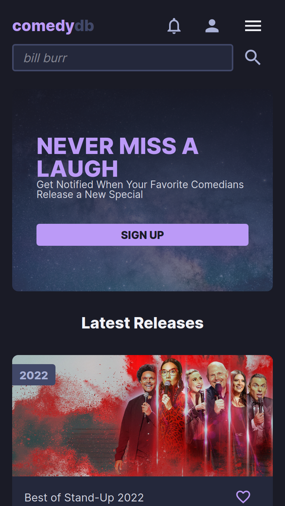

> mobile: special


> mobile: login

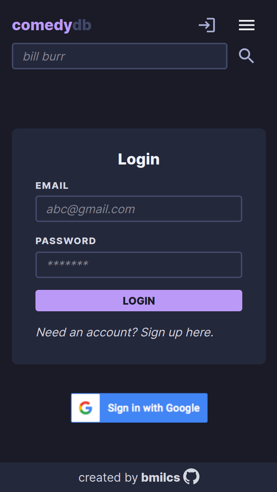

> mobile: favorites

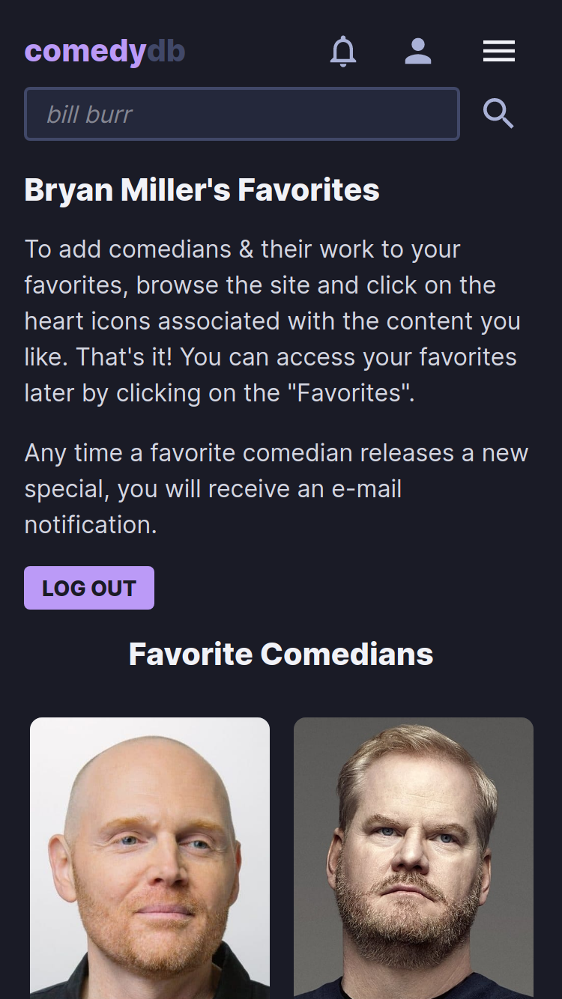

> mobile: add comedian modal

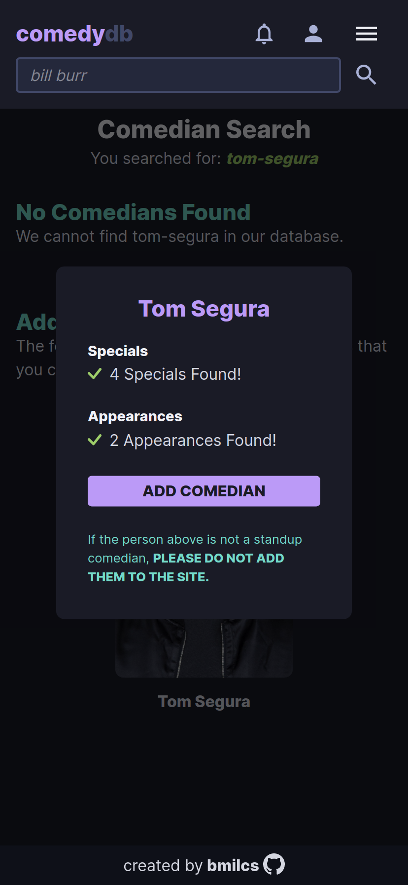

> tablet: notifications

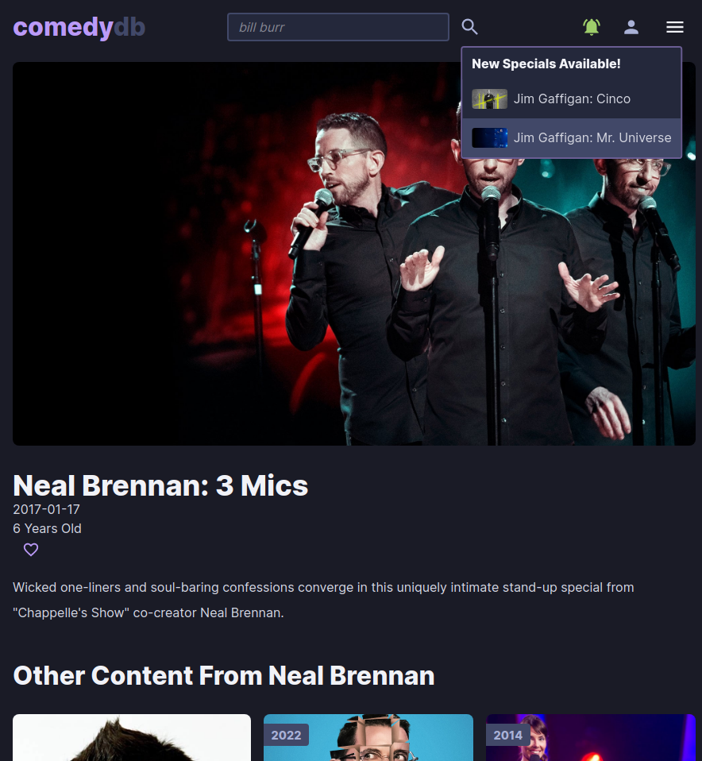

> tablet: search bar

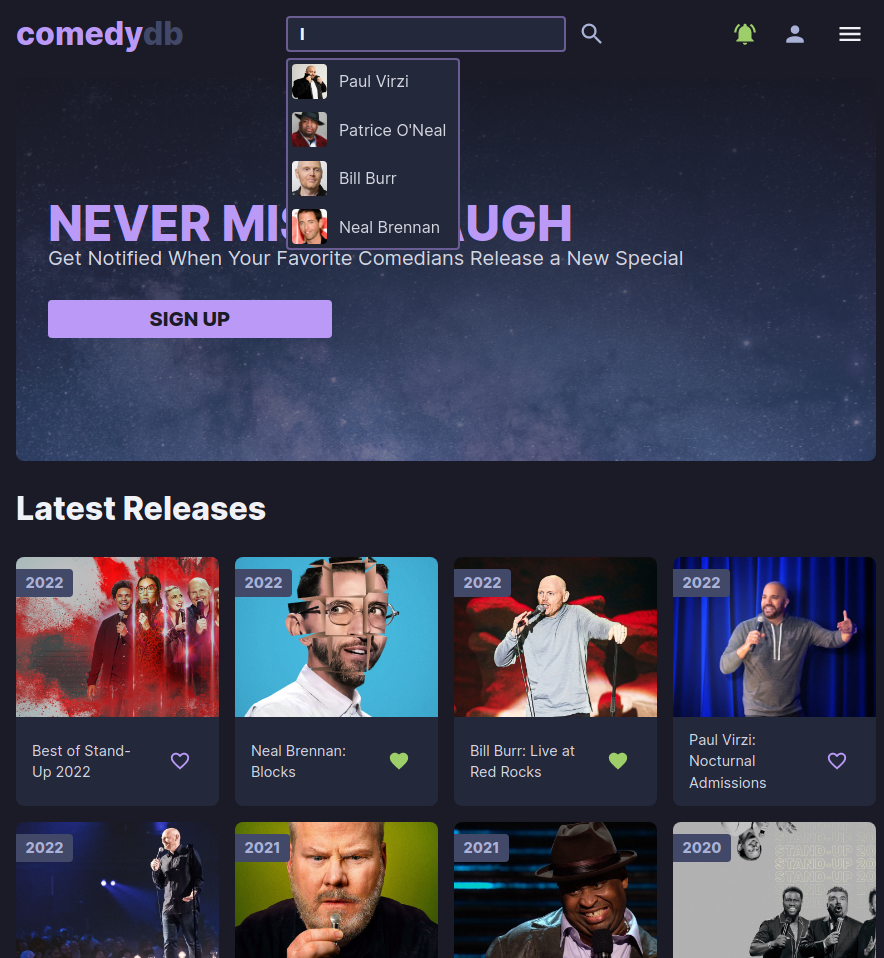

> desktop: comedian

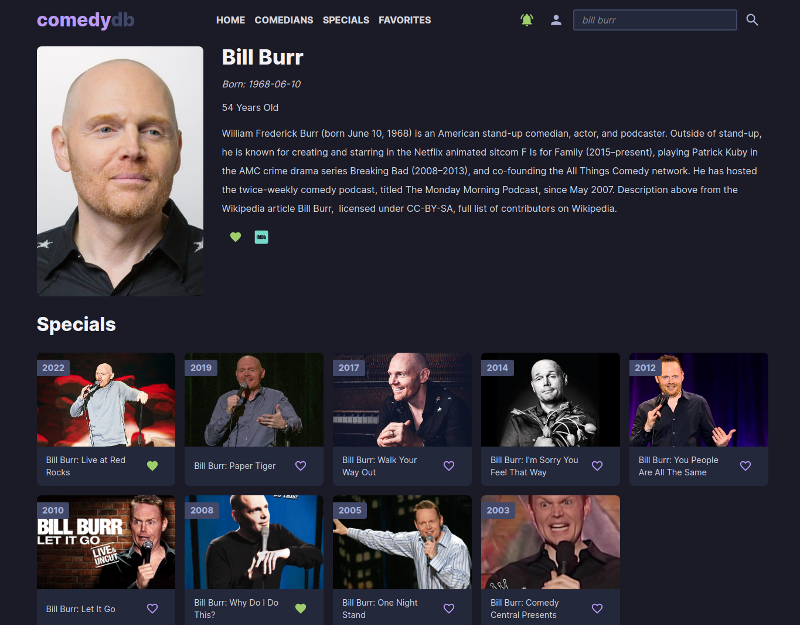

> desktop: special

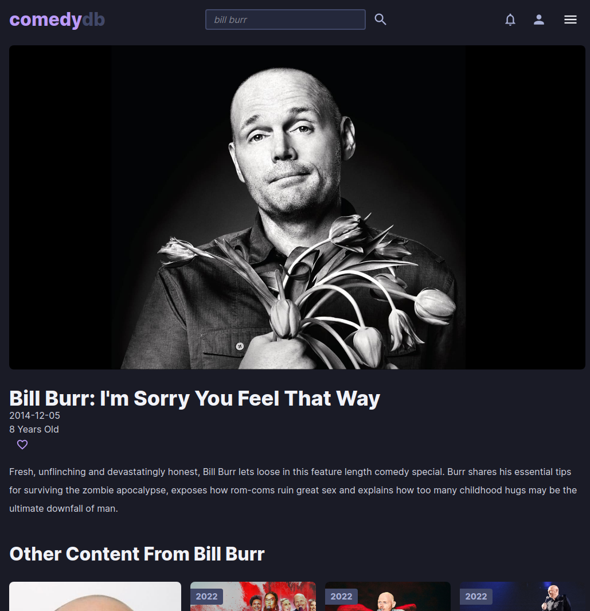

## Deployment

```sh
# clone repo & change directories
git clone https://github.com/bmilcs/odin-javascript-final-project
cd javascript-final-project

# install all dependencies
npm install

# run app
npm start
```
